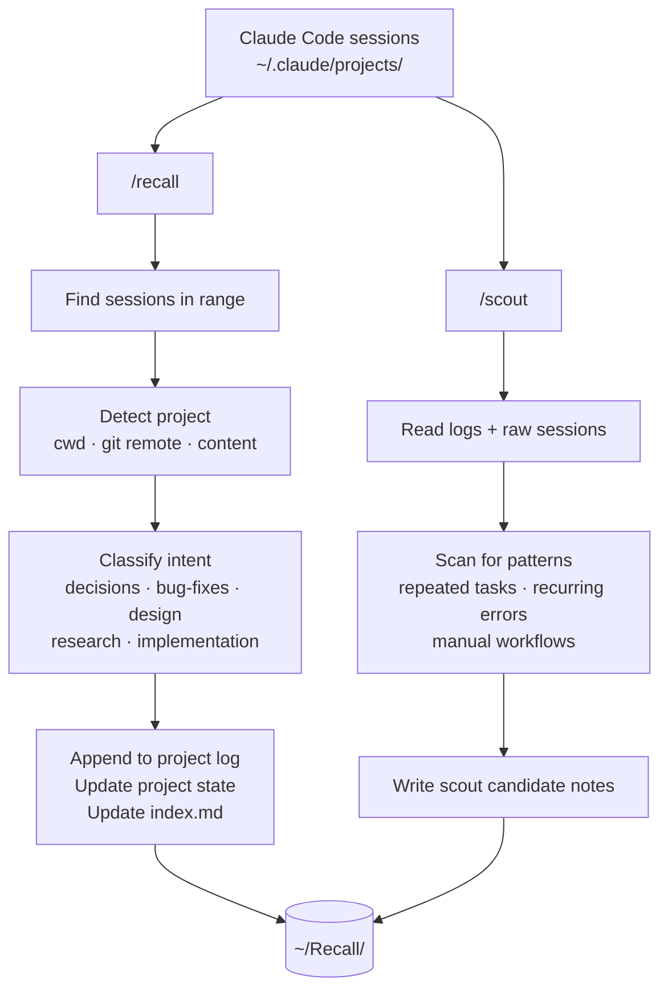

# skill-scout

> Reads your Claude Code sessions, classifies them by intent, and finds what should be automated.

Every day you work in Claude Code, context disappears when the session ends — decisions made, bugs fixed, patterns that keep recurring. `skill-scout` captures that context and surfaces what's worth automating.

Two Claude Code skills, no external dependencies, one command at end of day.

---

## How it works



---

## Vault structure

```
~/Recall/
├── index.md                     ← one-line summary of every project
├── Projects/
│   └── {project-name}/
│       ├── {project}-log.md     ← append-only session history
│       └── {project}-state.md   ← current state of the project (updated in place)
└── Scout/
    └── {candidate-slug}.md      ← one file per automation opportunity
```

### `/recall` output — per project

| File | What it is | How it's updated |
|------|-----------|-----------------|
| `{project}-log.md` | Every session, dated and classified by intent | Append only |
| `{project}-state.md` | What the project is, what's built, open questions | Overwritten each run (current truth) |
| `index.md` | One-line summary per project with last-updated date | Overwritten each run |

### `/scout` output

One note per automation candidate in `Scout/`. Each note contains: what was observed, which sessions it appeared in, suggested automation type (script / MCP / agent / hook / skill), effort estimate, and a suggested next step.

---

## Setup

```bash
# 1. Clone and run setup (creates ~/Recall/ vault structure)
git clone https://github.com/YOUR_USERNAME/skill-scout.git
cd skill-scout
bash setup.sh

# 2. Install skills globally so they work from any project
mkdir -p ~/.claude/skills/recall ~/.claude/skills/scout
cp .claude/skills/recall/SKILL.md ~/.claude/skills/recall/SKILL.md
cp .claude/skills/scout/SKILL.md ~/.claude/skills/scout/SKILL.md
```

That's it. No API keys, no config, no dependencies.

---

## Usage

Run at the end of your day from any project in Claude Code:

```
/recall today          ← summarise today's sessions into the vault
/scout today           ← scan for automation opportunities
/recall this week      ← catch up on a full week
/recall 2026-04-11     ← specific date
```

`/recall` deduplicates automatically — running it twice on the same day won't create duplicate entries.

---

## Repo structure

```
skill-scout/
├── .claude/
│   └── skills/
│       ├── recall/
│       │   └── SKILL.md    ← /recall skill definition (install globally)
│       └── scout/
│           └── SKILL.md    ← /scout skill definition (install globally)
├── recall.py               ← Agent SDK runner for automated/cron use
├── schedule.sh             ← nightly cron script
├── setup.sh                ← one-time vault setup + cron install
└── PRD.md                  ← full product requirements
```

---

## Automation (optional)

`recall.py` uses the Claude Agent SDK with `permission_mode="bypassPermissions"` — intended for unattended cron runs without permission popups.

`schedule.sh` runs `/recall today` and `/scout today` via `npx @anthropic-ai/claude-code --print` each night.

To install the cron job: `bash setup.sh` (requires Terminal to have Full Disk Access in System Settings → Privacy & Security).

---

## Project detection

Sessions run from workspace directories like `DEV_MODE/` (which contains multiple repos) are mapped to their actual project by checking — in order:

1. Working directory path in the session (`cwd`)
2. Git remote URL in the session
3. Project name mentioned in session content
4. Folder name fallback (used only when all else fails)

This means sessions from `DEV_MODE/skill-scout/` and `DEV_MODE/ai_digest/` go into separate vault folders, not lumped together under `DEV-MODE`.
