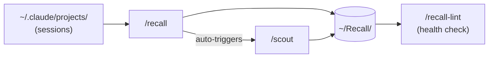

# skill-scout

> Three Claude Code skills that turn your daily sessions into a searchable knowledge vault and surface what's worth automating.

No config. Works from any project. Requires Python 3.10+ and a Claude Max/Team/Enterprise subscription.

---

## Skills

| Skill | What it does |
|-------|-------------|
| `/recall` | Reads your sessions, classifies them by intent, writes structured notes into `~/Recall/` |
| `/scout` | Scans sessions for repeated patterns and flags automation candidates |
| `/recall-lint` | Health-checks the vault — stale projects, broken links, orphan folders |

`/recall` triggers `/scout` automatically based on session volume. You only need to run them separately on demand.

---

## How it works



---

## Vault structure

```
~/Recall/
├── index.md                  ← one-line summary of every project
├── log.md                    ← global session timeline
├── Projects/
│   └── {project}/
│       ├── {project}-log.md  ← append-only session history
│       └── {project}-state.md← current state, open questions
└── Scout/
    └── {slug}.md             ← one file per automation candidate
```

---

## Setup

**Prerequisites:** Python 3.10+, Claude Code installed, Claude Max/Team/Enterprise subscription.

```bash
git clone https://github.com/YOUR_USERNAME/skill-scout.git
cd skill-scout
```

**1. Create the venv and install the SDK:**

```bash
python3.10 -m venv skill-scout-env
skill-scout-env/bin/pip install claude-agent-sdk
```

**2. Run the one-time installer:**

```bash
bash setup.sh
```

This creates `~/Recall/`, copies all three skills to `~/.claude/skills/`, and installs the 6pm cron job.

**3. Grant Terminal Full Disk Access** so cron can read `~/.claude/projects/`:
`System Settings → Privacy & Security → Full Disk Access → add Terminal`

---

## Usage

### Interactive (inside a Claude Code session)

```
/recall today         ← log today's sessions
/recall yesterday     ← log yesterday's sessions
/recall this week     ← catch up on the week
/recall 2026-04-11    ← specific date
/scout today          ← scan for automation opportunities
/scout this week      ← scan the full week for patterns
/recall-lint          ← health-check the vault
```

### Headless (terminal, no Claude Code session needed)

```bash
# recall only
skill-scout-env/bin/python3.10 recall.py today
skill-scout-env/bin/python3.10 recall.py yesterday
skill-scout-env/bin/python3.10 recall.py "this week"

# recall + scout together (recommended)
skill-scout-env/bin/python3.10 recall.py yesterday && skill-scout-env/bin/python3.10 scout.py yesterday
skill-scout-env/bin/python3.10 recall.py "this week" && skill-scout-env/bin/python3.10 scout.py "this week"
```

---

## Project detection

Sessions are mapped to projects by checking in order: working directory path → git remote URL → session content → folder name fallback. Sessions from `DEV_MODE/skill-scout/` and `DEV_MODE/ai_digest/` go into separate vault folders automatically.

---

## Automation

Three files power the nightly cron run:

| File | Role |
|------|------|
| `setup.sh` | One-time installer — run once after cloning |
| `schedule.sh` | Cron entry point — fires at 6pm, skips if no new sessions |
| `recall.py` / `scout.py` | Headless skill runners — called by schedule.sh |

`recall.py` and `scout.py` read their `SKILL.md` at runtime via the Agent SDK (`bypassPermissions`) — no popups, no interaction. Uses your Claude subscription — no separate API key needed.
