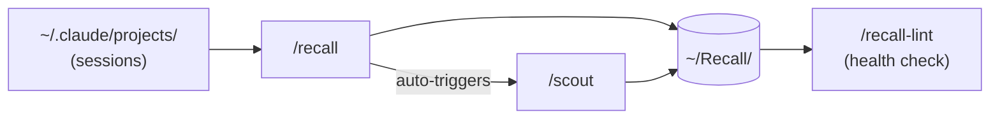

# skill-scout

> Three Claude Code skills that turn your daily sessions into a searchable knowledge vault and surface what's worth automating.

No external dependencies. No config. Works from any project.

---

## Skills

| Skill | What it does |
|-------|-------------|
| `/recall` | Reads your sessions, classifies them by intent, writes structured notes into `~/Recall/` |
| `/scout` | Scans sessions for repeated patterns and flags automation candidates |
| `/recall-lint` | Health-checks the vault — stale projects, broken links, orphan folders |

`/recall` triggers `/scout` automatically based on session volume. You only need to run them separately on demand.

---

## How it works



---

## Vault structure

```
~/Recall/
├── index.md                  ← one-line summary of every project
├── log.md                    ← global session timeline
├── Projects/
│   └── {project}/
│       ├── {project}-log.md  ← append-only session history
│       └── {project}-state.md← current state, open questions
└── Scout/
    └── {slug}.md             ← one file per automation candidate
```

---

## Setup

```bash
git clone https://github.com/YOUR_USERNAME/skill-scout.git
cd skill-scout
bash setup.sh

# Install skills globally
mkdir -p ~/.claude/skills/recall ~/.claude/skills/scout ~/.claude/skills/recall-lint
cp .claude/skills/recall/SKILL.md ~/.claude/skills/recall/SKILL.md
cp .claude/skills/scout/SKILL.md ~/.claude/skills/scout/SKILL.md
cp .claude/skills/recall-lint/SKILL.md ~/.claude/skills/recall-lint/SKILL.md
```

---

## Usage

```
/recall today         ← log today's sessions
/recall this week     ← catch up on the week
/recall 2026-04-11    ← specific date
/scout today          ← scan for automation opportunities
/recall-lint          ← health-check the vault
```

---

## Project detection

Sessions are mapped to projects by checking in order: working directory path → git remote URL → session content → folder name fallback. Sessions from `DEV_MODE/skill-scout/` and `DEV_MODE/ai_digest/` go into separate vault folders automatically.

---

## Automation (optional)

`recall.py` runs `/recall` + `/scout` unattended via the Claude Agent SDK. `setup.sh` installs a nightly cron job (requires Terminal Full Disk Access in System Settings → Privacy & Security).
