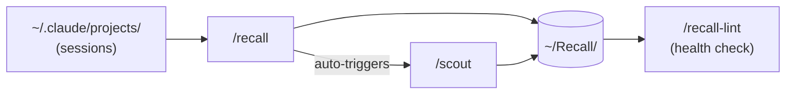

# skill-scout

> Three Claude Code skills that turn your daily sessions into a searchable knowledge vault and surface what's worth automating.

No config. Works from any project. Requires Python 3.10+ and a Claude Max/Team/Enterprise subscription.

---

## Skills

| Skill | What it does |
|-------|-------------|
| `/recall` | Reads your sessions, classifies them by intent, writes structured notes into `~/Recall/` |
| `/scout` | Scans sessions for repeated patterns and flags automation candidates |
| `/recall-lint` | Health-checks the vault — stale projects, broken links, orphan folders |

`/recall` triggers `/scout` automatically based on session volume. You only need to run them separately on demand.

---

## How it works



---

## Vault structure

```
~/Recall/
├── index.md                  ← one-line summary of every project
├── log.md                    ← global session timeline
├── Projects/
│   └── {project}/
│       ├── {project}-log.md  ← append-only session history
│       └── {project}-state.md← current state, open questions
└── Scout/
    └── {slug}.md             ← one file per automation candidate
```

---

## Setup

**Prerequisites:** Python 3.10+, Claude Code installed, Claude Max/Team/Enterprise subscription.

```bash
git clone https://github.com/YOUR_USERNAME/skill-scout.git
cd skill-scout
```

**1. Create the venv and install the SDK:**

```bash
python3.10 -m venv skill-scout-env
skill-scout-env/bin/pip install claude-agent-sdk
```

**2. Run the one-time installer:**

```bash
bash setup.sh
```

This creates `~/Recall/`, copies all three skills to `~/.claude/skills/`, and installs the 6pm cron job.

**3. Grant Terminal Full Disk Access** so cron can read `~/.claude/projects/`:
`System Settings → Privacy & Security → Full Disk Access → add Terminal`

---

## Three ways to run

### 1. As a Claude Code skill (interactive)

The simplest way — run directly inside any Claude Code session, no setup beyond `setup.sh`.

```
/recall today         ← log today's sessions
/recall yesterday     ← log yesterday's sessions
/recall this week     ← catch up on the week
/recall 2026-04-11    ← specific date
/scout today          ← scan for automation opportunities
/scout this week      ← scan the full week for patterns
/recall-lint          ← health-check the vault
```

### 2. Headless from the terminal

Run `recall.py` and `scout.py` directly — no Claude Code session needed. Useful for catching up on a specific day or week without opening the IDE.

```bash
# log a specific time range
skill-scout-env/bin/python3.10 recall.py today
skill-scout-env/bin/python3.10 recall.py yesterday
skill-scout-env/bin/python3.10 recall.py "this week"
skill-scout-env/bin/python3.10 recall.py "last week"
skill-scout-env/bin/python3.10 recall.py 2026-04-11

# recall + scout together (recommended)
skill-scout-env/bin/python3.10 recall.py yesterday && skill-scout-env/bin/python3.10 scout.py yesterday
skill-scout-env/bin/python3.10 recall.py "this week" && skill-scout-env/bin/python3.10 scout.py "this week"
```

### 3. Cron job (fully automated, runs nightly)

`setup.sh` installs a cron job that fires at 6pm every day. It checks for new sessions and runs recall + scout automatically — nothing to remember.

**If you want to set it up manually or change the time:**

```bash
crontab -e
```

Add this line (replace `/path/to/skill-scout` with your actual path):

```
0 18 * * * /path/to/skill-scout/schedule.sh
```

Change `18` to whatever hour you prefer (24h format). `schedule.sh` skips silently if there are no new sessions that day, so it's safe to run at any time.

All output is logged to `~/Recall/schedule.log`.

---

## Project detection

Sessions are mapped to projects by checking in order: working directory path → git remote URL → session content → folder name fallback. Sessions from `DEV_MODE/skill-scout/` and `DEV_MODE/ai_digest/` go into separate vault folders automatically.

---

## References

- [LLM Wiki](https://gist.github.com/karpathy/442a6bf555914893e9891c11519de94f) — Andrej Karpathy's pattern for compounding LLM-maintained knowledge bases, which inspired `~/Recall/`
- [claude-memory-compiler](https://github.com/coleam00/claude-memory-compiler) — reference for Agent SDK subscription auth and `.claude/settings.json` permissions
